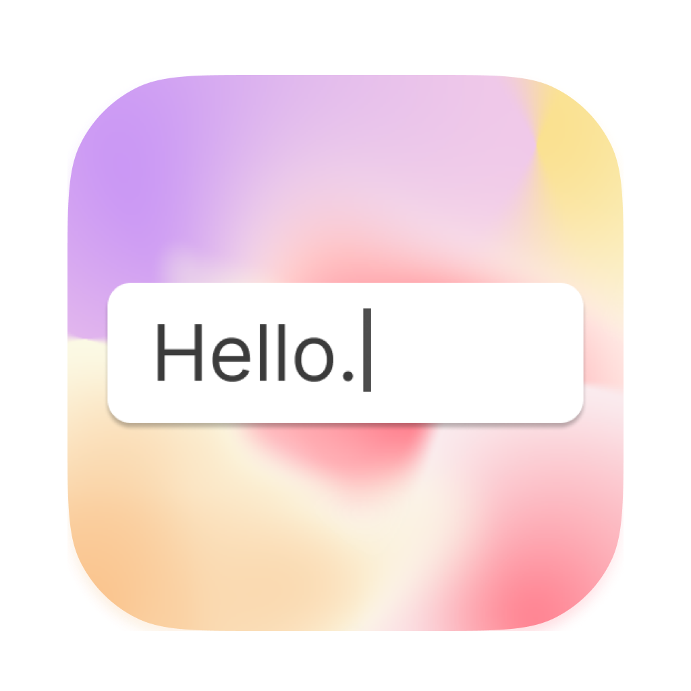
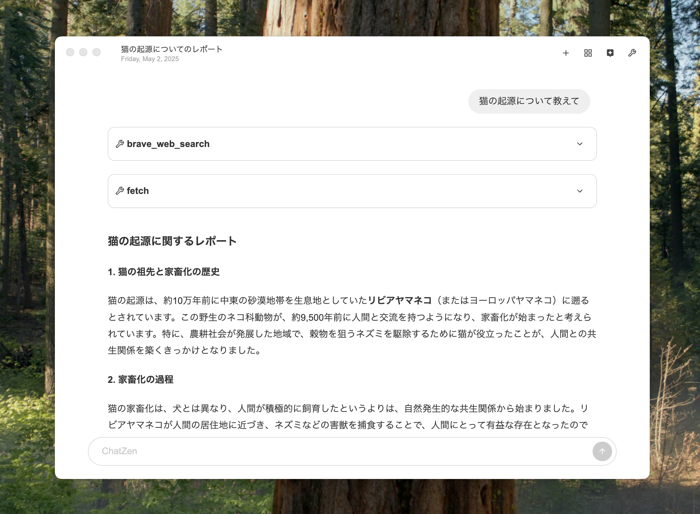

# ChatZen(α)

- ChatZenはMCP(Model Context Protocol)に対応したLLMチャットクライアントです
- OpenAI、Claude、Gemini、Deepseekに対応しています
- ファイルシステムベースのMarkdownストレージを使用



## 機能

- 軽量で高速なチャットインターフェース
- マークダウン形式でのチャット履歴保存
- スレッドとメッセージの全文検索機能
- 複数のLLMモデルとツール使用のサポート

## ストレージシステム

Chat Zenはファイルシステムベースの**Markdownストレージ**を使用しています。このストレージシステムは以下の操作を提供します：
- スレッドの作成・取得・更新・削除
- メッセージの作成・取得
- スレッドとメッセージの全文検索

### Markdownストレージの構造

```
userData/
  threads/
    {thread_id}/
      metadata.json  # タイトル、作成日時などのメタデータ
      messages/
        {timestamp}_{role}_{uuid}.md  # 各メッセージをファイルとして保存
```

Markdownストレージの主な利点：
- ファイルシステムベースの検索を活用できる
- 外部ツールやエディタでの編集が容易
- バージョン管理システム（Git等）と連携しやすい
- 人間が読み書きしやすいテキスト形式

### メッセージファイル形式

各メッセージファイルはYAMLフロントマターを含むMarkdown形式で保存されています：

```markdown
---
id: 1234-5678
threadId: abcd-efgh
role: user
createdAt: 2023-01-01T12:00:00.000Z
updatedAt: 2023-01-01T12:00:00.000Z
---

こんにちは、世界！
```

ツールメッセージの場合は追加のメタデータと空の本文になります：

```markdown
---
id: 8765-4321
threadId: abcd-efgh
role: tool
toolName: calculator
toolReq: "1 + 1"
toolRes: "2"
createdAt: 2023-01-01T12:05:00.000Z
updatedAt: 2023-01-01T12:05:00.000Z
---

```

## Settings

`Command`+`,`で設定ファイルを開いて以下のように設定してください。

```json
{
  "model": "gpt-4o-mini",
  "assistant": "Deep Research",
  "models": ["gpt-4o-mini", "deepseek-chat", "gemini-2.5-flash-preview-04-17"],
  "maxSteps": 32,
  "instructions": "You help user.",
  "assistants": [
    {
      "name": "Deep Research",
      "instructions": "BraveSeachとFetchでページにアクセスすることを繰り返してあらゆる情報を集めて結果を長文のレポートでまとめてください。",
      "tools": [
        "brave-search_brave_web_search",
        "fetch_fetch",
        "cosense-mcp-server_search_pages",
        "cosense-mcp-server_list_pages",
        "cosense-mcp-server_list_search_pages"
      ],
      "autoApprove": true
    },
    {
      "name": "ノートアシスタント",
      "instructions": "/Users/username/Noteの下にMarkdownファイルがあるのでユーザーの指示に従いそのファイル群を読み書きしてください。"
    },
    {
      "name": "ChatZen Development",
      "instructions": "/Users/username/Development/chat-zenのコードを調べてユーザーの指示に従ってコーディングしてください。必要に応じてライブラリの仕様を参照してください。",
      "tools": ["claude_code_.+", "mastra-docs", "electron-docs"]
    },
    {
      "name": "Deep GitHub",
      "instructions": "GitHubリポジトリのコードをgithub_search_codeのツール利用を何回も繰り返すことでじっくりと調査してください。それを元にユーザーの質問に答えてください",
      "tools": ["github_search_code", "github_get_file_contents", "github_search_repositories"]
    }
  ],
  "apiKeys": {
    "openai": "***",
    "anthropic": "***",
    "google": "***",
    "deepseek": "***"
  },
  "mcpServers": {
    "electron-docs": {
      "url": "https://gitmcp.io/electron/electron"
    },
    "mastra-docs": {
      "url": "https://gitmcp.io/mastra-ai/mastra"
    },
    "brave-search": {
      "command": "docker",
      "args": ["run", "-i", "--rm", "-e", "BRAVE_API_KEY", "mcp/brave-search"],
      "env": {
        "BRAVE_API_KEY": "***"
      }
    },
    "fetch": {
      "command": "uvx",
      "args": ["mcp-server-fetch"]
    },
    "cosense-mcp-server": {
      "command": "npx",
      "args": ["-y", "@yosider/cosense-mcp-server"],
      "env": {
        "COSENSE_PROJECT_NAME": "villagepump"
      }
    },
    "filesystem": {
      "command": "npx",
      "args": ["-y", "@modelcontextprotocol/server-filesystem", "/Users/username/Note"]
    },
    "claude_code": {
      "command": "claude",
      "args": ["mcp", "serve"],
      "env": {}
    },
    "github": {
      "command": "docker",
      "args": [
        "run",
        "-i",
        "--rm",
        "-e",
        "GITHUB_PERSONAL_ACCESS_TOKEN",
        "ghcr.io/github/github-mcp-server"
      ],
      "env": {
        "GITHUB_PERSONAL_ACCESS_TOKEN": "***"
      }
    }
  },
  "tokenLimit": 127000
}
```
